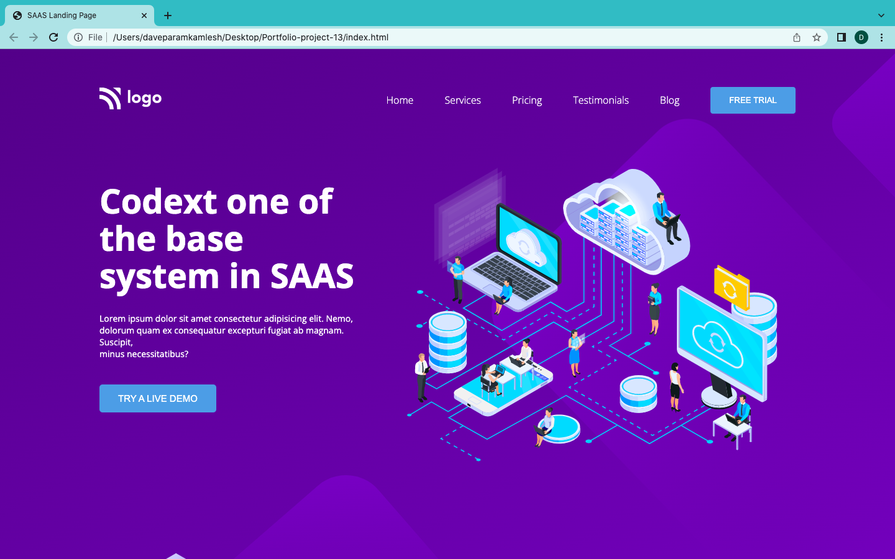
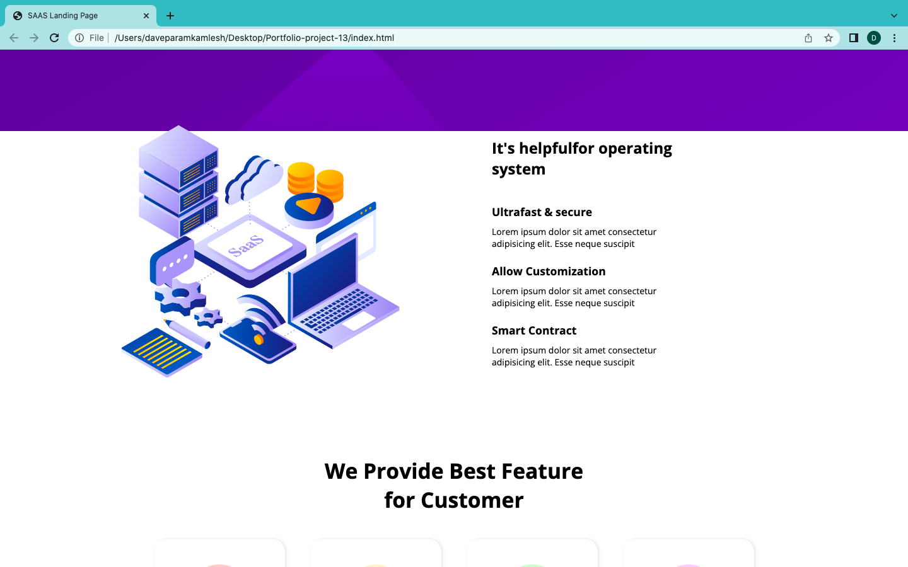
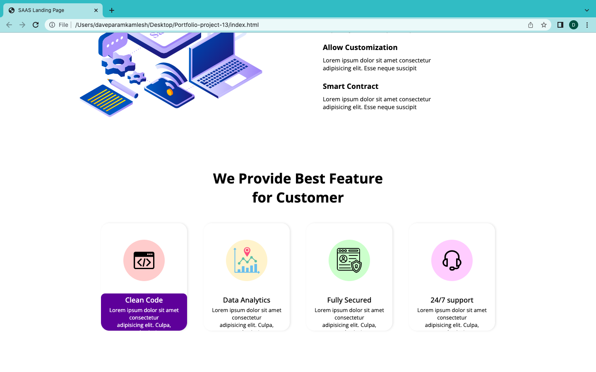

# Portfolio project 13

This is a one page portfolio template project made in HTML and CSS.

# Project live link

[Portfolio-project-13](https://whimsical-faun-d35c07.netlify.app)

# Screenshot

# My learnings from this projects

- I learned to design beautiful navber and buttons.
- I learned to design beautiful card.

# Time to finish the projecet

I took about 4-5 hours approximately to complete this project.
